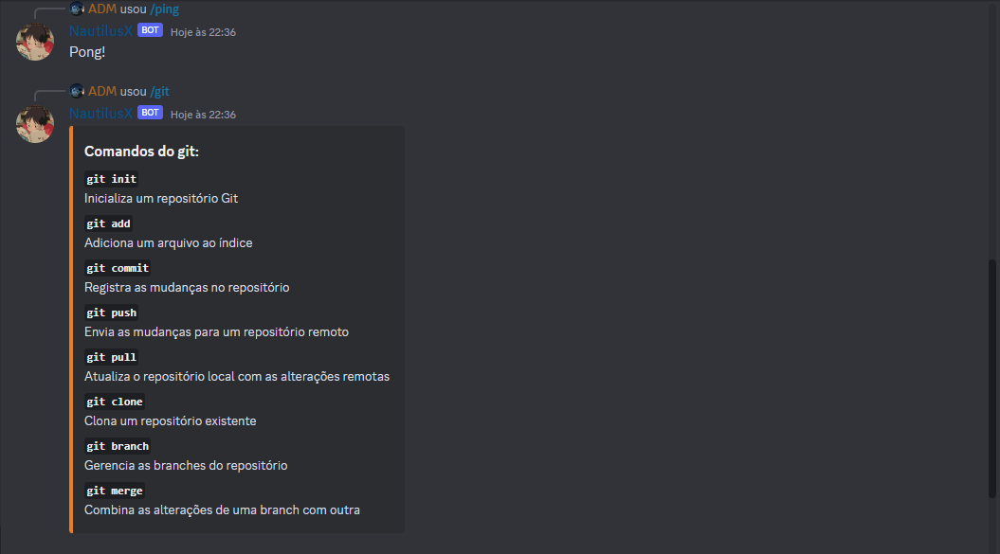

<h1 align="center">
DISCORD BOT
</h1>

<h2>🖊️ Description</h2>

> <h3>Discord bot. This is a prototype bot for discord, it has 4 simple features. </h3>

> *Developed during the @rafaballerini video*

 

<h2>How to use</h2>

> <h4>1 - Download the files to your machine. </h4>
>
> <h4> 2 - Download project dependencies with `npm install` </h4>
>
> <h4>3 - Add an .env file, at the root of the project.</h4>
>
> <h4> 4 - Configure environment variables inside the .env file. Example: </h4>
 

~~~
BOT_TOKEN= YOUR_TOKEN_BOT_DISCORD
CLIENT_ID= YOUR_ID_CLIENT
GUILD_ID= YOUR_ID_GUILD
~~~

> Obs: Make sure you create your bot on the [Discord Developers](https://discord.com/developers/applications) website, and the server too!

> After that, run the application with `npm .` or `npm index.js`

